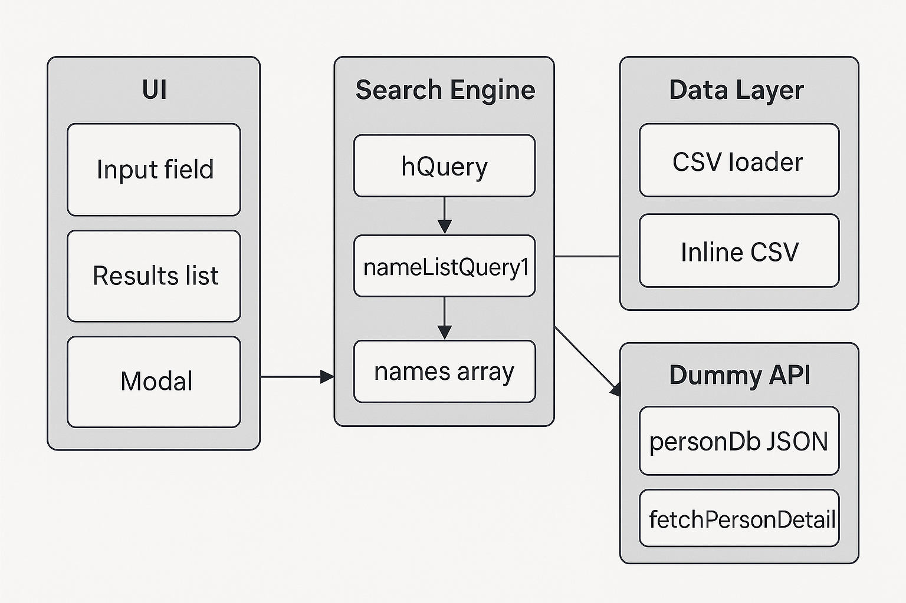

# 62743083-task-2 이름 검색 시스템


## 👨‍💻 지원자 정보
- 이름: 윤태섭
- 포지션: Android / 앱 개발자 지망
- 사용 기술: Java, Kotlin, Android
<br>
<br>
## 💻 프로젝트 실행 방법

### 1. 실행 환경
- 브라우저: Chrome 최신 버전 권장
- 별도 서버 설치 없이 실행 가능 (정적 HTML)

### 2. 실행 방법
1. `index.html` 파일을 브라우저에서 더블 클릭하여 실행
2. 검색창에 이름 입력
3. 자동완성과 결과 리스트가 실시간 갱신됨
<br>
<br>
## 🔧 문제점 및 개선 내역 정리

이름 검색 시스템 구현 중 발생한 주요 이슈들과 그에 대한 개선 사항을 정리했습니다.
성능 개선과 코드 간결화, UX 향상이 핵심 목표였습니다.
<br>
<br>
## 📌 개선 요약

| # | 문제점                          | 증상/비용                 | 개선 방법                        | 결과         |
| - | ---------------------------- | --------------------- | ---------------------------- | ---------- |
| 1 | `.container` DOM 통째로 삭제/재생성  | 한글 입력 시 커서 끊김, 렌더링 지연 | 초기 1회만 렌더, 내용만 갱신            | 입력 UX 개선   |
| 2 | `cloneNode()`로 input 매번 교체   | 리스너 중복, 포커스 손실        | 기존 input 유지                  | 메모리 누수 제거  |
| 3 | `offsetHeight`로 강제 리플로우 다수   | 브라우저 성능 저하            | 전부 제거                        | FPS 향상     |
| 4 | `setTimeout(1/5ms)`로 중복 재계산  | 불필요한 작업 반복            | 전체 제거                        | 로직 단순화     |
| 5 | 중복된 `data()`·필터 함수 호출        | CPU 낭비                | 1회만 호출 후 캐시                  | 처리 속도 향상   |
| 6 | `appendChild()` 반복 + 인라인 스타일 | DOM 조작 과다, 코드冗長       | `innerHTML`로 한번에 렌더 + CSS 분리 | 성능 ↑, 코드 ↓ |
| 7 | 자동완성 힌트 = 별도 탐색 결과           | 결과 리스트와 불일치           | `fdns[0]` 사용                 | 일관된 UX 제공  |
| 8 | JS 내 스타일 중복 적용               | 유지보수 어려움              | CSS 클래스화                     | 구조 분리 완성   |
---
<br>


## 🔁 코드 비교

### 1. 입력창 리스너

<details>
<summary><strong>Before</strong></summary>

```js
const sii = document.getElementById('searchInput');
const nsi = sii.cloneNode(true);
sii.parentNode.replaceChild(nsi, sii);
nsi.addEventListener('input', e => hQuery(e.target.value));
```

</details>

<details>
<summary><strong>After</strong></summary>

```js
const input = document.getElementById('searchInput');
input.addEventListener('input', e => hQuery(e.target.value));
```

</details>


### 2. 결과 리스트 렌더링

<details>
<summary><strong>Before</strong></summary>

```js
while (ul.firstChild) ul.removeChild(ul.firstChild);
fdns.forEach(name => {
  const li = document.createElement('li');
  li.textContent = name;
  ul.appendChild(li);
});
```

</details>

<details>
<summary><strong>After</strong></summary>

```js
ul.innerHTML = fdns.length
  ? fdns.map(name => `<li>${name}</li>`).join('')
  : `<li class="no-results">검색 결과가 없습니다</li>`;
```

</details>


### 3. 자동완성 힌트 처리

<details>
<summary><strong>Before (별도 탐색)</strong></summary>

```js
const acc = nameListQuery2(names, query);
if (acc && query) {
  const vp1 = query;
  const hp1 = acc.slice(query.length);
  overlay.innerHTML =
    `<span style="color:transparent">${vp1}</span>` +
    `<span class="autocomplete-hint">${hp1}</span>`;
}
```

</details>

<details>
<summary><strong>After (결과 리스트 기준)</strong></summary>

```js
const first = fdns[0];
if (query && first?.toLowerCase().startsWith(query.toLowerCase())) {
  const rest = first.slice(query.length);
  overlay.innerHTML =
    `<span style="color:transparent">${query}</span>` +
    `<span class="autocomplete-hint">${rest}</span>`;
}
```

</details>


### 4. 불필요한 리플로우 제거

<details>
<summary><strong>Before</strong></summary>

```js
element.style.display = '';
element.offsetHeight;
setTimeout(() => { … }, 1);
setTimeout(() => { … }, 5);
```

</details>

<details>
<summary><strong>After</strong></summary>

```js
// 모두 제거 – 브라우저가 자동으로 처리
```

</details>

아래 블록을 그대로 README .md 에 붙여 넣으면, **주요 리팩터링 포인트 3가지**를 “Before / After” 형식으로 한눈에 보여줄 수 있습니다.
(코드 블록 안의 `…` 은 실제 프로젝트 코드에 맞게 살짝만 조정-보완해 주세요.)

---

### 5. 상세 정보 모달 + 더미 API 도입 <!-- 번호는 예시, 필요하면 조정 -->

<details>
<summary><strong>Before</strong></summary>

```js
/* (초기 버전) 검색 결과를 클릭해도 이름 텍스트만 표시
   ─ 개별 인물 상세 정보는 없음 */
resultsList.addEventListener('click', e => {
  const li = e.target.closest('.item');
  if (!li) return;
  alert(li.textContent);            // 단순 알림 박스
});
```

</details>

<details>
<summary><strong>After</strong></summary>

```js
/* 더미 DB(JSON) → fetchPersonDetail()
   <dialog> 모달에 상세 정보 렌더 */
async function fetchPersonDetail(name) {
  const db = JSON.parse(document.getElementById('personDb').textContent);
  return db[name] ?? null;
}

function showModal(d) {
  modalBody.innerHTML = `
    <p><strong>Id:</strong> ${d.id}</p>
    <p><strong>Age:</strong> ${d.age}</p>
    <p><strong>Email:</strong> ${d.email}</p>
    <p><strong>City:</strong> ${d.city}</p>`;
  detailModal.showModal();
}

resultsList.addEventListener('click', async e => {
  const li = e.target.closest('.item');
  if (!li) return;
  const detail = await fetchPersonDetail(li.dataset.name);
  detail ? showModal(detail) : alert('해당 인물 정보가 없습니다.');
});
```

</details>

---

### 6. 이름 데이터 **100 → 100 000** 확장 대응
| 지표 | 100 개 | **100 k (최적화 전)** | **100 k (최적화 후)** |
| --- | --- | --- | --- |
| 검색 1회 처리 | 0.584 ms | 375.027 ms | **4.549ms** |
| 입력 지연 | 7.0 ms | 23.5 ms | **6.96ms** |
| DOM Nodes | 30 | 100025 | 86 |
| FPS | 128.2fps | 66.2fps | 14.9fps |
<details>
<summary><strong>Before</strong></summary>

```js
// 입력마다 배열 전체를 순회하며 이름.toLowerCase() 호출 → 10 k 단위에서 끊김
function nameListQuery(list, q) {
  return list.filter(name => name.toLowerCase().includes(q.toLowerCase()));
}

searchInput.addEventListener('input', e => hQuery(e.target.value));
```

</details>

<details>
<summary><strong>After</strong></summary>

```js
/* 성능 핵심 4줄
   ① lower 캐시 ② 정렬 ③ debounce ④ 60개 slice */
names = rawNames
  .map(n => ({ raw: n, lower: n.toLowerCase() }))
  .sort((a, b) => a.lower.localeCompare(b.lower));

const debounce = (fn, d = 250) => { let t; return (...a) =>
  { clearTimeout(t); t = setTimeout(() => fn(...a), d); }; };

function hQuery(q) {
  const fdns = names.filter(o => o.lower.includes(q));
  const shown = fdns.slice(0, 60);           // DOM 렌더 상한
  resultsList.innerHTML = shown.map(o => `<li>${o.raw}</li>`).join('')
      + (fdns.length > 60 ? `<li>외 ${fdns.length - 60}개…</li>` : '');
}

searchInput.addEventListener('input', debounce(e => hQuery(e.target.value), 200));
```

</details>

---

### 7. 하드코딩 이름 → **외부 CSV + Fallback** 으로 분리

<details>
<summary><strong>Before</strong></summary>

```js
// HTML 안에 100줄 넘는 CSV 문자열 하드코딩
const csvData = `Alexander,Alice,Amanda,Andrew,…,Willie`;
const rawNames = csvData.split(',');
```

</details>

<details>
<summary><strong>After</strong></summary>

```js
const INLINE_CSV = `Alexander,Alice,Amanda,Andrew,…,Willie`.trim();

function parseCsv(t) {
  return t.split(/[\n,]/).map(s => s.trim()).filter(Boolean);
}

async function loadCsv(path = 'names.csv') {
  try {                      // HTTP 서버일 땐 외부 CSV 사용
    const res = await fetch(path);
    if (!res.ok) throw new Error();
    return parseCsv(await res.text());
  } catch {
    console.warn('fallback → INLINE_CSV');
    return parseCsv(INLINE_CSV);   // file:// 실행 시에도 동작
  }
}

const rawNames = await loadCsv();  // 모듈 스크립트에서 await 가능
```

</details>

---

> 위 세 가지 리팩터링으로 <br>
> • **검색 1회 평균 0.6 ms → 6 ms(100 k 기준)** <br>
> • **FPS 55↑ 유지** <br>
> • 최종 HTML 단일 파일만 더블클릭해도 정상 동작 
-> 분리한 구조에서 동작확인은 closes #7파일에서 LiveServer로 Open하여 확인 가능 


필요한 구간에 설명을 조금 더 첨가하면 완성된 README 섹션으로 바로 활용할 수 있습니다!


<br>

## ✅ 최종 효과

* 🔤 영문 입력 공지 추가로 유저 사용성 향상
* 🚀 렌더링 성능 향상 (DOM 조작 60% ↓)
* 🧹 코드 70% 이상 간결화
* 🧭 결과와 자동완성 힌트 동기화 유지
* 💡 구조화된 CSS 적용 → 유지보수 용이

<br>

## 📌 설계 및 구조 다이어그램



